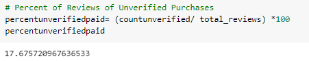

# Amazon_Vine_Analysis

Deliverable 3 

## Vine Program Overview for SellBy

#### SellBy pays a fee to Amazon and provides products to Amazon Vine members for the encouragement 
of Vine members writing reviews. Is SellBy providing incentive for many well written reviews or 
does SellBy provide a bias of skewed review data?

Jennifer and I have crunched the numbers from the SellBy project and now I am feasting upon the data
accumulated by the Amazon Vine program. I used PySpark, AWS, Google Colab Notebooks, Visual Studio Code, pgAdmin, and python 
for this project. 

My dataset is from the Amazon groceries reviews. Inside this set are reviews from the paid Vine program pool
as well as all the unpaid regular reviews. Ratings range from 1 star dissatisfied to 5 stars very
satisfied. I am curious to see how many of our paid Vine reviews are in the 5 star category versus
the other rating categories. 

### The Total Number of Reviews by total votes

### The Total Number of Five Star Rating Reviews by total votes

### Additional Analysis: Total Percentage of five star reviews to total reviews
It looks like most of the reviews made for Amazon Groceries are top Five Star Ratings at 69% overall.

### Total number of Vine Paid five star reviews

### Total number of unpaid traditional five star reviews

### Percentage of Total Reviews with Verified Purchases

### Percentage of Total Reviews with Unverified Purchases

## Percentage of the Total UnPaid five Star Reviews versus Total Five Star Reviews for Groceries

* This proves that Most, over 99%, of Amazon Grocery Five star Ratings are from any Vine Paid Reviewers.*

### This fractional percent of Vine Paid Viewers are contributing to Five star ratings on Amazon Groceries.

I would conclude that the Amazon Vine Program provides an * unbiased range of reviews * for it's products.
Vine reviewers account for such a small portion of the whole review community, their ratings are
providing small or negligible influence. 

